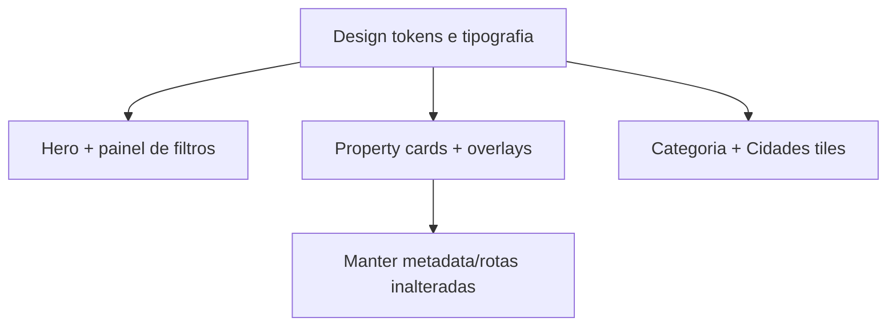

## Objetivo

Deixar o seu frontend com uma identidade visual mais “premium/editorial”, reduzindo a sensação de design genérico “cara de IA”, usando como referência o invistaii.com.br (estrutura de filtros/hero, hierarquia de preço/título, cards com overlays e tipografia mais marcada), sem replicar o layout de forma idêntica.

## Abordagem

- Manter as cores atuais (vars em `src/app/globals.css`).
- Criar um conjunto menor de “design tokens” (tokens de superfície, sombra e tipografia) para unificar o visual.
- Ajustar componentes existentes (hero, property cards, seções de destaque, categorias e rodapé) para um padrão de composição mais intencional.

## Diretrizes visuais extraídas (do invistaii)

- Hero com “módulo de busca/filtros” mais evidente (em vez de apenas CTAs).
- Cards/tiles com hierarquia forte: preço em destaque e título bem legível.
- Superfícies com sombras sutis e recortes/arredondamentos consistentes.
- Espaçamento e tipografia com escala maior para seções-chave (destaques, oportunidades e listagens).

## Implementação por etapas

### 1) Tokens e tipografia (base do visual)

- Atualizar `src/app/globals.css` para adicionar tokens de fundo/superfície (ex.: `--surface`, `--shadow-...`, `--radius-...`) e um “noise/grain” leve via CSS (data-uri SVG) no `body` ou em uma wrapper.
- Atualizar `src/app/layout.tsx` para trocar apenas a tipografia de headings (mantendo fonte base). Proposta de fontes (Google Fonts):
  - Headings: uma serif editorial (ex.: `Fraunces`) ou alternativa similar.
  - Corpo: manter `Inter`.

### 2) Hero com módulo de busca (inspiração do invistaii)

- Atualizar `src/components/sections/hero-section.tsx`:
  - Transformar o bloco central em uma composição com duas colunas (desktop) e empilhada (mobile).
  - Manter o título e subtítulo, mas incluir um “panel” de filtros inspirado no invistaii.
  - Reaproveitar `src/components/search/filter-bar.tsx` como o motor (client component), mas redesenhar o container/estilo ao redor: card com bordas, sombra e botão de “Pesquisar / Ver imóveis”.

### 3) Unificar UI de cards (menos “genérico”)

- Redesenhar `src/components/property/property-card.tsx`:
  - Inserir overlay no canto inferior da imagem com preço em fonte maior e contraste.
  - Exibir “ref/código” usando `property.id` (ex.: `Cód. 0001`) para imitar hierarquia do invistaii sem copiar.
  - Ajustar ícones/linha de atributos para ficar mais compacta e alinhada.
- Redesenhar `src/components/sections/featured-properties.tsx`:
  - Ajustar grid para ficar mais “editorial” (mesmo conteúdo, composição diferente):
    - desktop: cards com alturas consistentes
    - mobile: manter 1 coluna

### 4) Oportunidades especiais com composição premium

- Atualizar `src/components/sections/special-opportunities.tsx`:
  - Usar um card principal com imagem maior e coluna de conteúdo com espaçamentos maiores.
  - Manter o badge dourado (`oportunidade`), mas com fundo/halo e posição refinada.
  - Tornar o CTA mais claro (Botão/WhatsApp com destaque maior e menos “texto solto”).

### 5) Categorias e CitySection com visual de “seção de descoberta”

- Atualizar `src/components/sections/category-cards.tsx`:
  - Trocar os cards-ícone por “tiles” com layout mais rico (título e microcopy). Pode manter ícone, mas reduzir o tamanho e melhorar tipografia.
  - Adotar hover com “lift” mais sutil + borda/acento.
- Atualizar `src/components/sections/city-section.tsx`:
  - Inserir background visual nos cards (gradiente + imagem opcional via Unsplash, se você aceitar). Se preferir 100% sem imagens, usar apenas gradientes texturizados.

### 6) Seções institucionais e CTA com “textura” e hierarquia

- Atualizar `src/components/sections/institutional-section.tsx`:
  - Adicionar bloco de “benefícios” (em 3 pontos) com ícones leves.
  - Ajustar o layout para reduzir o “cara de site template”.
- Atualizar `src/components/sections/cta-section.tsx`:
  - Melhorar contraste e adicionar um detalhe visual (por exemplo, “edge glow” usando `box-shadow` e recortes com gradiente).

### 7) Ajustes finais de acessibilidade/consistência

- Garantir que:
  - `focus-visible` está consistente em botões/links.
  - Contraste está adequado nos overlays do card.
  - Botões e áreas clicáveis têm área confortável.

## Diagrama (como as mudanças se conectam)

## Arquivos-alvo (principais)

- `src/app/globals.css`
- `src/app/layout.tsx`
- `src/components/sections/hero-section.tsx`
- `src/components/search/filter-bar.tsx`
- `src/components/property/property-card.tsx`
- `src/components/sections/featured-properties.tsx`
- `src/components/sections/special-opportunities.tsx`
- `src/components/sections/category-cards.tsx`
- `src/components/sections/city-section.tsx`
- `src/components/sections/institutional-section.tsx`
- `src/components/sections/cta-section.tsx`

## Plano de testes

- Rodar `pnpm lint`.
- Rodar `pnpm build`.
- Rodar `pnpm dev` e validar manualmente: `/`, `/imoveis`, `/imoveis/venda`, `/imovel/[slug]`, `/sobre`, `/contato`.

